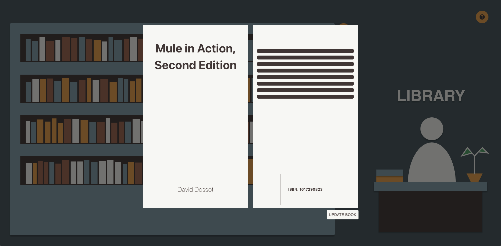

# Library
A book management application created for Infoxchange's full stack coding challenge. The project is
implemented using the MERN stack. MongoDB is used as the app's storage component, Express and NodeJS
used to implement the backend component, and React is used to implement the front-end component.

[Watch demo here](docs/demo.mp4)




# Getting Started
## Prerequisites
- [Docker](https://docs.docker.com/get-docker/) - Setting up local mongoDB
- [NodeJS](https://nodejs.org/en/) - running both server and client

## Setting up local backend
```shell
cd backend
npm install
./scripts/start-db.sh # creates mongo container
npm run populate-db # populate database with values
npm start # start the backend server
```

## Setting up local client
```shell
cd library-client
npm install
npm start
```

# Testing
In either `library-client` or `backend` directory, run `npm run test`.
